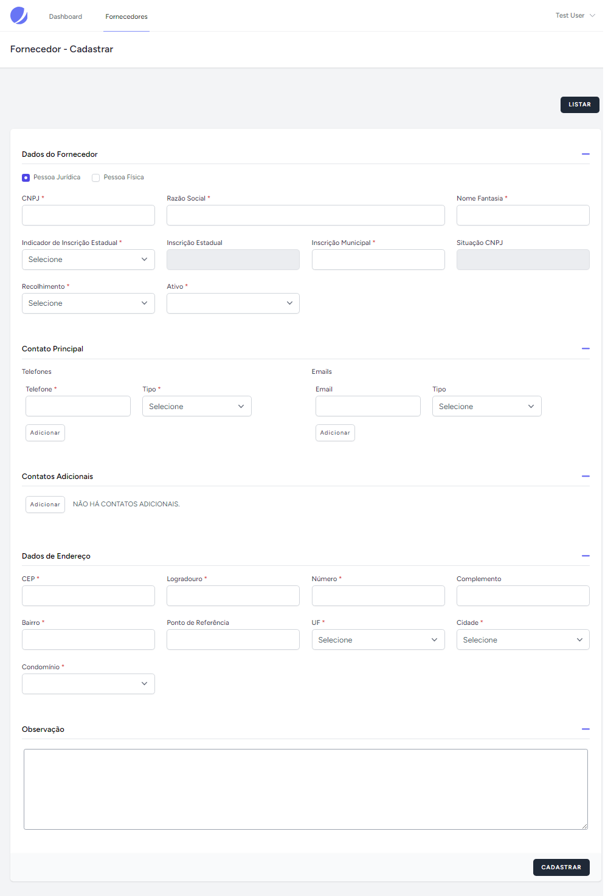

# Laravel Na Prática - Desafio
Este repositório contém um projeto simples construído usando PHP e Laravel. O objetivo deste repositório é praticar e compartilhar um sistema simples de cadastro de fornecedor.

## Instalação

1. Clone o repositório:
```bash
$ git clone git@github.com:VidalGuilherme/laravel-napratica.git
```

2. Entre no diretório do projeto
```bash
$ cd laravel-napratica
```

3. Execute com docker-compose
```bash
$ docker-compose up -d
$ docker exec -it laravel-napratica-phpfpm /bin/bash
```

4. Instalar/atualizar composer
```
$ composer install 

OU

$ docker exec laravel-napratica-phpfpm composer install
```

5. Configurar as variáveis de ambiente 
```bash
$ cp .env.example .env
```

6. Configurar o banco de dados
```bash
$ php artisan migrate:fresh --seed

OU

$ docker exec laravel-napratica-phpfpm php artisan migrate:fresh --seed
```

7. Instalar os pacotes NPM
```bash
$ npm install

OU

$ docker exec laravel-napratica-phpfpm npm install
```

8. Build
```bash
$ npm run build

OU 

$ docker exec laravel-napratica-phpfpm npm run build
```

9. Visite o aplicativo em http://localhost:8383

```bash
Dados de acesso:
	Email: test@email.com
	Passsword: 12345678
```


## Docker

```bash
$ docker-compose up -d
```

```bash
$ docker exec -it laravel-napratica-phpfpm /bin/bash 
```

To install Docker locally you can [click here](https://www.docker.com/products/docker-desktop/).

